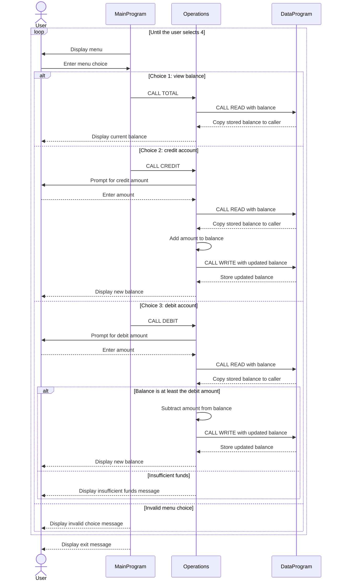

# COBOL Program Documentation

This directory documents the COBOL account-management program in `src/cobol/`. The current implementation keeps one account balance; it does not store student profiles or distinguish accounts by student.

## COBOL files

| File | Purpose | Key functions |
|---|---|---|
| `main.cob` (`MainProgram`) | Interactive entry point and menu loop. | Displays the menu, accepts a choice, dispatches view, credit, and debit requests to `Operations`, and exits when the user selects 4. Invalid menu choices display an error and return to the menu. |
| `operations.cob` (`Operations`) | Implements balance viewing and account transactions. | `TOTAL ` reads and displays the current balance; `CREDIT` accepts an amount, adds it, stores the result, and displays the new balance; `DEBIT ` accepts an amount and subtracts it only when funds are sufficient. |
| `data.cob` (`DataProgram`) | Holds the in-memory balance and provides read/write access to it. | `READ` copies the stored balance to the caller; `WRITE` replaces the stored balance with the caller's value. The stored balance starts at 1,000.00 and is not saved to a file or database. |

## Student-account business rules

- The program manages a single balance, initially 1,000.00, represented with two decimal places.
- A credit increases the balance by the entered amount and updates the in-memory balance for the current program run.
- A debit is applied only if the current balance is greater than or equal to the entered amount. Otherwise, the program reports insufficient funds and leaves the balance unchanged.
- The source does not validate that transaction amounts are positive, nor does it define a student identity, account status, eligibility criteria, fees, or student-specific limits. Those rules should not be assumed to exist.

## Application data flow

